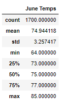
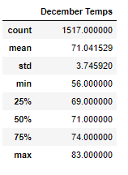

# surfs_up

## Synopsis
Our client would like to invest in the shop we are trying open a shop on the island of Oahu, Hawaii.  Information about local temperature trends are needed as part of the decision making process on opening the store as the business partially "cold food" related.  The analysis is conducted with a SQLite database, in Python, using Jupyter Notebook.

## Analysis
* Looking at these two months we can conclude there is not much temperature change (approx 4 degrees for the mean).
* We may be able to assume min temps (coldest) may be early morning hours while the shop would not be operational.
* Based on this data alone, it would be a great place to have an ice cream shop.
* Surfing temps look fantastic in both months.

### June Temperatures
 

### December Temperatures

## Insights for Additional Study
*  Precipitation is not a good gauge in the case of Oahu as it rains almost every day for about 20 minutes. (Nothing like experience - lived there for a while as a kid :smile:).
